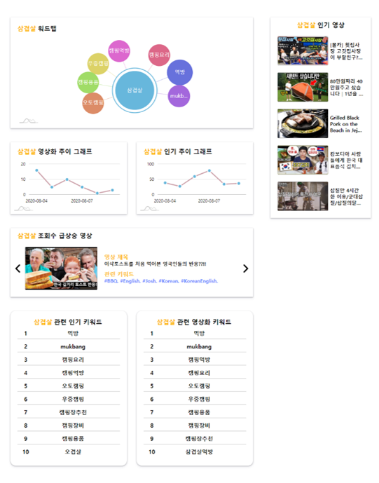
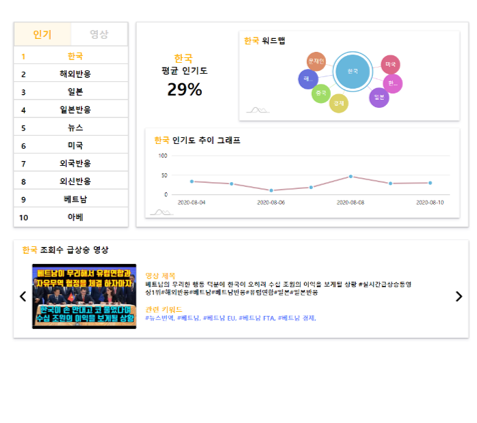
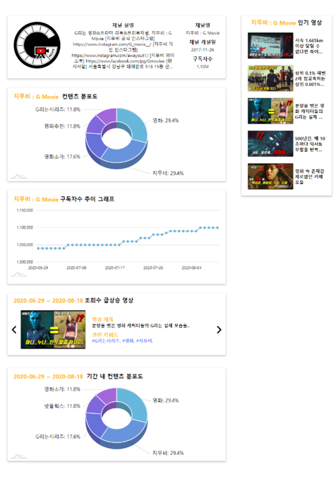

# CreateTrend(Front-End)

유튜브 크리에이터들위한 채널 성장 지원 솔루션을 제공하는 AI Assistant 개발 (Front-End Repository)

## Summary

---

- [CreateTrend(Front-End)](#createtrendfront-end)
  - [Summary](#summary)
  - [Example](#example)
  - [How it Works](#how-it-works)
  - [Getting Started](#getting-started)
    - [Prerequisites](#prerequisites)
  - [Installing & Starting](#installing--starting)
  - [Deployment](#deployment)
  - [Built With](#built-with)
  - [Authors](#authors)
  - [License](#license)

## Example

---

> Keyword Page

<p></p>

> Statistics Page

<p></p>

> Star Page

<p></p>

## How it Works

---

1. 페이지를 로딩하거나 차트에서 특정 action을 취할 때 서버로 부터 API를 받아옵니다.

2. Redux를 통해 생성한 store에서 받아온 API의 data들을 프로젝트의 state에 mapping 시킵니다.

3. state가 갱신될 때 state의 값을 바탕으로 amcharts4를 통해 생성한 차트와 그래프들의 형태를 reload 시킵니다.

## Getting Started

---

이 지침을 따르시면 로컬 PC에서 개발과 테스트를 위한 해당 프로젝트의 사본을 실행, 설치, 배포시킬 수 있습니다.

### Prerequisites

프로젝트를 실행시키기 위해 다음 프로그램들이 필요합니다.

```
- NPM (https://nodejs.org/en)
- Git (https://git-scm.com)
```

## Installing & Starting

---

해당 프로젝트의 사본을 설치 및 실행하기 위해 다음 단계들을 거쳐야 합니다.

- git을 통해 로컬에 프로젝트 Clone 하기

  > 'https://git.swmgit.org/swmaestro/muna.git'를 통해 사용자의 로컬 PC로 프로젝트를 Clone 합니다.

* Window의 경우 Git Bash 등을 통해 입력합니다.
* Linux, MacOS 등등에서는 Terminal을 통해 입력합니다.
* GitHub Desktop을 통해서도 Clone이 가능합니다.

- 로컬 프로젝트의 NPM Update 하기

  > 로컬 프로젝트가 설치 된 위치에서 다음 명령어를 통해 앞서 설치한 NPM을 Update 합니다.

  ```
  npm update
  ```

- 프로젝트 실행하기
  > 로컬 프로젝트가 설치 된 위치에서 다음 명령어를 통해 프로젝트를 실행합니다.
  ```
  npm start
  ```

## Deployment

---

> 로컬 프로젝트가 설치 된 위치에서 다음 명령어를 통해 프로젝트를 build 합니다.

```
npm run build
```

- 생성된 build 산출물들을 웹 서버의 root directory에 복사 후 서버를 재실행 시켜야 합니다.

## Built With

---

- [ReacttJS](https://ko.reactjs.org/) - 웹 프레임워크
- [Redux](https://redux.js.org/) - 어플리케이션의 state 관리 라이브러리
- [Amcharts4](https://www.amcharts.com/) - 동적인 차트 및 그래프 생성 라이브러리

## Authors

---

- **이경수(grandnet1225@gmail.com)** - [gangselee](https://13.125.91.162/swmaestro/muna)

## License

---

[](http://badges.mit-license.org)

- Licensed under the [MIT License](LICENSE)
