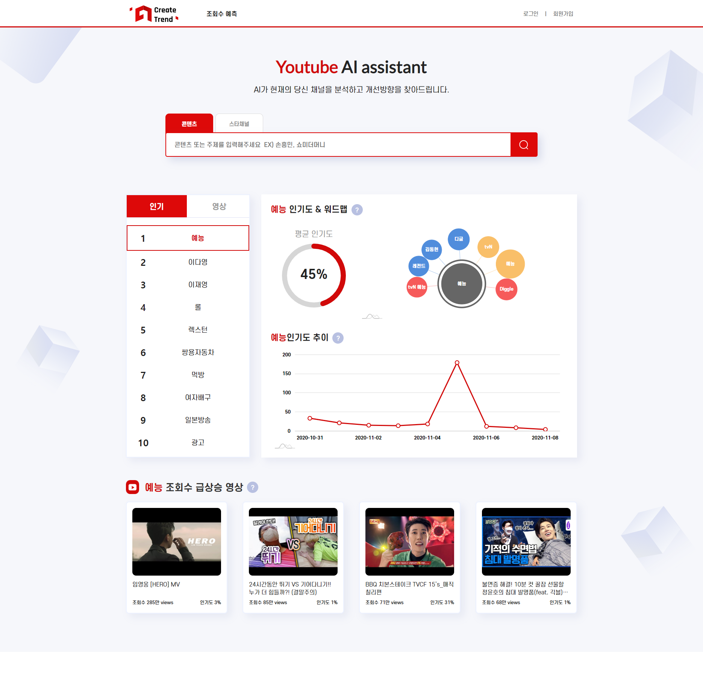
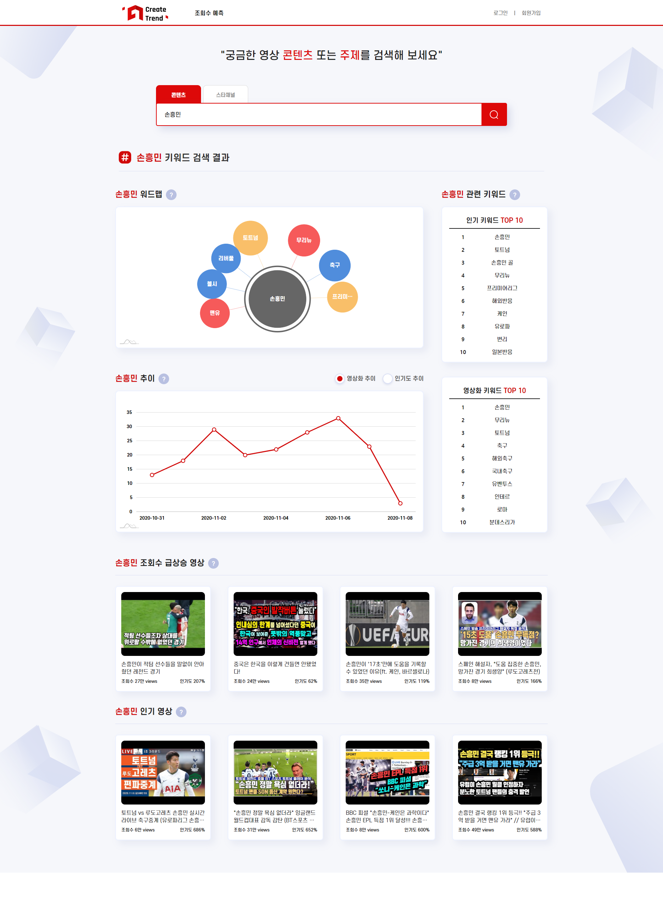
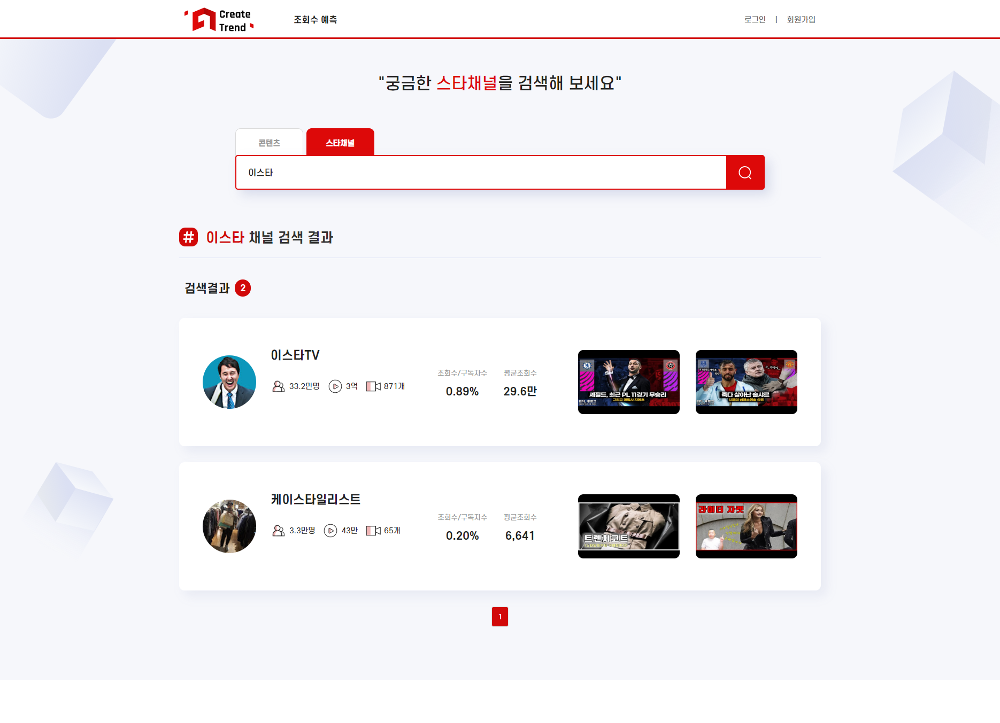
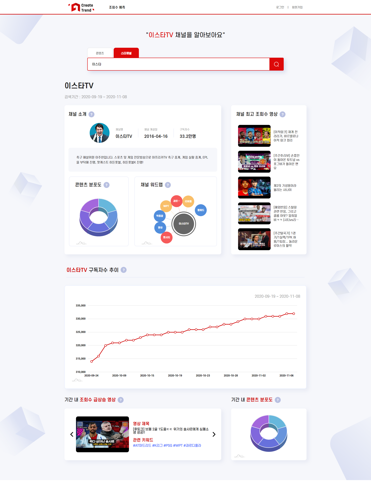
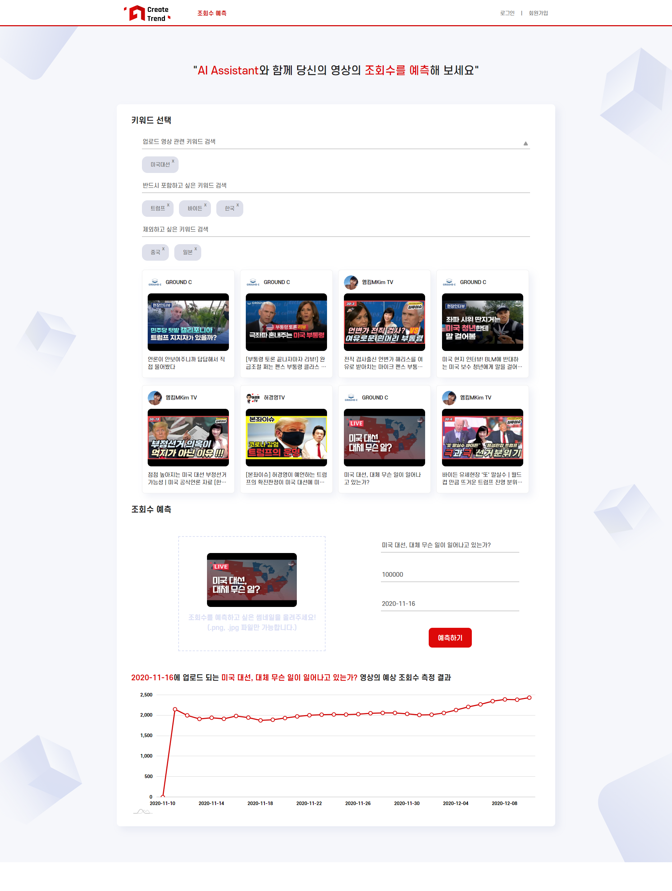
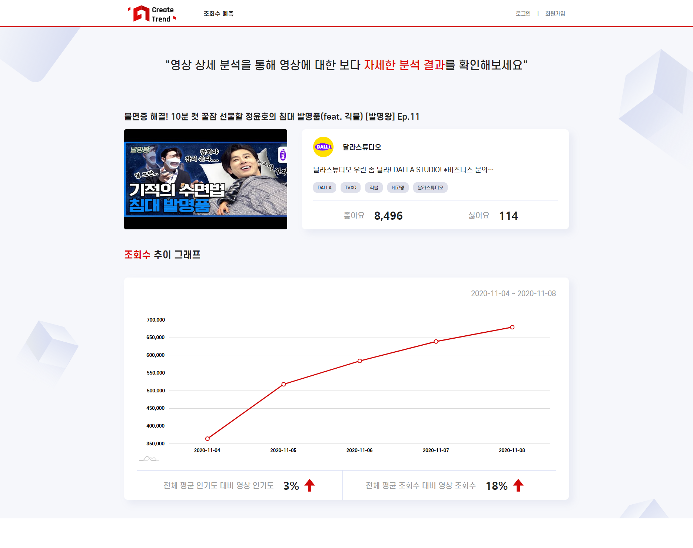

# CreateTrend(Front-End)

유튜브 크리에이터들위한 채널 성장 지원 솔루션을 제공하는 AI Assistant 개발 (Front-End Repository)

## Summary

  - [Example](#example)
  - [How it Works](#how-it-works)
  - [Getting Started](#getting-started)
  - [Installing & Starting](#installing--starting)
  - [Deployment](#deployment)
  - [Built With](#built-with)
  - [Authors](#authors)
  - [License](#license)

## Example

> 메인 페이지

<div style="padding:10px;"></div>

> 콘텐츠(키워드) 검색 페이지

<div style="padding:10px;"></div>

> 채널 검색 결과 페이지

<div style="padding:10px;"></div>

> 채널 상세 분석 페이지

<div style="padding:10px;"></div>

> 조회수 예측 페이지

<div style="padding:10px;"></div>

> 영상 상세분석 페이지

<div style="padding:10px;"></div>

## How it Works

### Common

차트 생성

>1. 페이지를 로딩하거나 차트에서 특정 action을 취할 때 API를 통해 서버로부터 차트 생성에 필요한 데이터를 받아옵니다.
>2. Redux를 통해 생성한 store에서 받아온 API의 data들을 프로젝트의 state에 mapping 시킵니다.
>3. state가 갱신될 때 state의 값을 바탕으로 amcharts4를 통해 생성한 차트와 그래프들의 형태를 reload 시킵니다.

<br>

인증

>1. 브라우저 최초 로딩 시 브라우저의 localstorage에 auth token의 존재 여부를 확인하고 존재 할 시 자동 로그인을 실시합니다.
>2. 로그인 혹은 회원가입을 실시 할 경우 각각의 실행 창에서 요구하는 정보들을 제출하여 서버로 전송합니다.
>3. 입력 양식에 맞게 정보를 제출하였을 경우 서버로부터 생성된 회원정보와 auth token을 전달받습니다.
>4. 전달받은 회원정보와 auth token은 각각 Redux와 브라우저의 localstorage에 저장됩니다.

<br>

검색

>1. 검색창 상단에 '콘텐츠'/'스타채널' 탭을 이용해 검색타입을 설정합니다.
>2. 검색 타입에 따라 검색하고 싶은 '콘텐츠' 혹은 '채널명'을 입력하고 검색을 실시합니다.
>3. 검색결과 페이지로 이동하며 API를 통해 서버로부터 검색 결과에 필요한 데이터들을 전달 받아 다양한 형태로 화면에 나타납니다.

<br>

### 조회수 예측

일반 검색
>1. 검색창에 원하시는 키워드들을 입력 후 검색을 실시합니다.
>2. API를 통해 해당 키워드와 연관된 영상들의 썸네일과 제목 등의 정보를 전달받고 그리드 형태로 화면에 나타납니다.
>3. 클릭을 통해 나타난 모든 영상 중 1개를 선택할 수 있고 선택한 영상의 썸네일과 제목이 영상 조회수 예측 입력 폼에 자동으로 입력됩니다.

<br>

고급 검색
>1. 검색창 우측에 화살표 버튼을 통해 고급검색 기능을 활성화/비활성화 시킬 수 있습니다.
>2. 순서대로 '검색하고 싶은 키워드 목록', '반드시 포함하고 싶은 키워드 목록', '제외하고 싶은 키워드 목록'에 대해 입력이 가능하고 입력 후 검색을 실시합니다.
>3. API를 통해 해당 키워드와 연관된 영상들의 썸네일과 제목 등의 정보를 전달받고 그리드 형태로 화면에 나타납니다.
>4. 클릭을 통해 나타난 모든 영상 중 1개를 선택할 수 있고 선택한 영상의 썸네일과 제목이 영상 조회수 예측 입력 폼에 자동으로 입력됩니다.

<br>

조회수 예측
>1. 조회수 예측 입력폼에 썸네일에 사용될 이미지 파일, 영상 제목, 구독자 수, 예상 업로드 날짜를 모두 입력하고 '예측하기' 버튼을 통해 해당 정보들을 제출합니다.
>2. API를 통해 서버로 부터 예측 데이터를 전달 받고 차트 형태로 화면에 나타나게 됩니다.

<br>

### Facebook Pixel

페이지 접근
>1. React의 useLayoutEffect를 통해 component들이 화면에 그려짐과 동시에 코드에 심어놓은 Facebook Pixel을 통해 페이지 접근 여부를 추적합니다.

<br>

잠재 고객 확인
>1. 회원가입 제출 시 실행되는 함수에 Facebook Pixel을 심어놓고 회원가입 양식이 문제없이 제출 되는 경우 잠재 고객으로 판단 후 측정합니다.

## Getting Started

이 지침을 따르시면 로컬 PC에서 개발과 테스트를 위한 해당 프로젝트의 사본을 실행, 설치, 배포시킬 수 있습니다.

### Prerequisites

프로젝트를 실행시키기 위해 다음 프로그램들이 필요합니다.

```
- NPM (https://nodejs.org/en)
- Git (https://git-scm.com)
```

## Installing & Starting


해당 프로젝트의 사본을 설치 및 실행하기 위해 다음 단계들을 거쳐야 합니다.

- git을 통해 로컬에 프로젝트 Clone 하기

  > 'https://git.swmgit.org/swmaestro/muna.git' 를 통해 사용자의 로컬 PC로 프로젝트를 Clone 합니다.

* Window의 경우 Git Bash 등을 통해 입력합니다.
* Linux, MacOS 등등에서는 Terminal을 통해 입력합니다.
* GitHub Desktop을 통해서도 Clone이 가능합니다.

- 로컬 프로젝트의 NPM Update 하기

  > 로컬 프로젝트가 설치 된 위치에서 다음 명령어를 통해 앞서 설치한 NPM을 Update 합니다.

  ```
  npm update
  ```

- 프로젝트 실행하기
  > 로컬 프로젝트가 설치 된 위치에서 다음 명령어를 통해 프로젝트를 실행합니다.
  ```
  npm start
  ```

## Deployment


> 로컬 프로젝트가 설치 된 위치에서 다음 명령어를 통해 프로젝트를 build 합니다.

```
npm run build
```

- 생성된 build 산출물들을 웹 서버의 root directory에 복사 후 서버를 재실행 시켜야 합니다.

## Built With


- [ReacttJS](https://ko.reactjs.org/) - 웹 프레임워크
- [Redux](https://redux.js.org/) - 어플리케이션의 state 관리 라이브러리
- [Amcharts4](https://www.amcharts.com/) - 동적인 차트 및 그래프 생성 라이브러리
- [react-facebook-pixel](https://github.com/zsajjad/react-facebook-pixel) - React에서 Facebook Pixel 사용 및 관리 라이브러리
## Authors

- **이경수(grandnet1225@gmail.com)** - [gangselee](https://13.125.91.162/swmaestro/muna)

## License

[](http://badges.mit-license.org)

- Licensed under the [MIT License](LICENSE)
